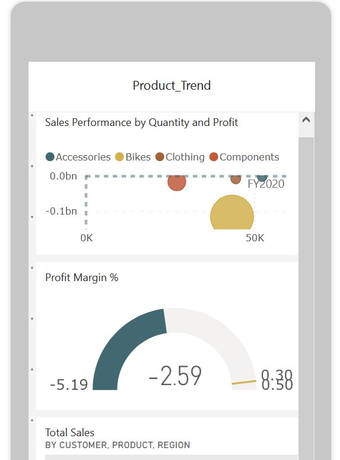
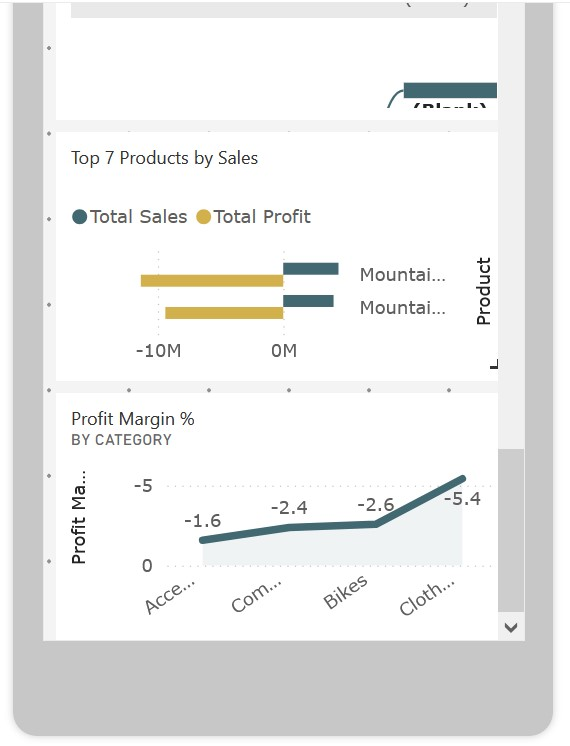

 ============================================

 PowerBI Practical Exam – [Mitchelle Moraa]

 ============================================

 __Overview__

   This project presents a data-driven sales performance dashboard developed using the AdventureWorksDW2020 dataset. The dashboard aims to uncover profit drivers, market trends, and customer behavior, providing actionable insights for decision-making. 
   Key objectives included identifying top-performing products, analyzing customer segments, and assessing geographic sales distribution to guide strategic growth.

 __Dataset & Preparation__

   Source: AdventureWorksDW2020
   Fact table: Sales , Products, Customers, Dates, Sales Territor

   In Power Query, I applied a structured sequence of transformations to clean, validate, and optimize the dataset. Key steps included:

 - **Missing values & null handling**
   - Replaced NAs with `null` values (`ReplaceNAwithNull`).
   - Created summary metrics (`TotalRows`, `ColumnList`, `ColumnsTable`) to validate completeness.
   - Added `NullCount` and `NullPercent` columns to measure missing data distribution across fields.

 - **Data type consistency**
   - Changed column data types to correct formats (`Changed Type`, `Changed Type1`).
   - Standardized numeric and date fields for compatibility with the model.

 - **Value standardization**
   - Applied multiple `Replaced Value` steps to clean inconsistent text values (e.g., category names, codes).
   - Split composite fields using `Split Column by Delimiter` for normalized analysis.

 - **Deduplication & integrity checks**
   - Removed duplicates at several stages (`Removed Duplicates`, `Removed Duplicates1`) to eliminate double entries.
   - Verified uniqueness of primary keys using row counts.

 - **Feature engineering**
   - Added custom calculated fields (`Added Custom`) such as derived metrics and classification flags.
   - Built conditional columns (`Added Conditional Column`) to categorize sales and customers into groups (e.g., High/Medium/Low).
   - Inserted an index column (`Added Index`) for tracking transformations and joins.

 - **Data profiling & validation**
   - Grouped rows (`Grouped Rows`) to summarize key metrics and ensure logical consistency across dimensions.
   - Counted rows (`Counted Rows`) for sanity checks against original fact tables.

 - **Column management**
   - Renamed columns to user-friendly names (`Renamed Columns`, `Renamed Columns1`) ensuring consistency across fact and dimension tables.
   - Created additional validation columns (e.g., `AddNullCount`, `AddNullPercent`) for monitoring data hygiene.

 - **Sorting & final structuring**
   - Sorted rows (`Sorted Rows`) to align reporting order.
   - Disabled load of staging queries for optimization.

   Power Query

   

   
   
   
   

 __Methodology__

   I structured the dataset into a **robust star schema** to support efficient querying, reduce redundancy, and enable advanced DAX calculations. The modeling process involved:

 - **Schema Design**
   - Defined a **central fact table** (Sales Fact) containing transactional measures such as Sales Amount, Quantity, Discount, and Profit.
   - Connected **14 supporting dimension tables** (15 tables in total) including:
    - **Date Dimension** (marked as a Date table for time intelligence).
    - **Customer Dimension** (demographics, customer segmentation).
    - **Product Dimension** (product hierarchy: Category → Subcategory → Product).
    - **Geography Dimension** (Country, Region, City).

 - **Relationships**
   - Established **one-to-many relationships** between dimensions and the fact table, using primary/foreign keys.
   - Configured **single-directional filters** to avoid ambiguity and improve performance.
   - Verified **no circular dependencies** or many-to-many joins were present.
   - Used **active relationships** for core analysis and created **inactive relationships** where alternate paths were needed (activated with DAX `USERELATIONSHIP()`).

 - **Time Intelligence**
   - Marked the Date Dimension as the official **Date Table**.
   - Enabled **hierarchies** (Year → Quarter → Month → Day) for drill-down analysis.
   - Created supporting calculated columns such as Year-Month

 - **Referential Integrity**
   - Ensured all fact table keys had matching records in dimensions 
   - Removed redundant or unused relationships to keep the model clean.

 - **Performance Optimization**
   - Reduced cardinality of certain columns 
   - Hid technical/staging columns not required by end-users.
  

   

   

   

 ## __Visualizations:__

   This project includes a suite of Power BI dashboards designed to provide actionable insights into customer behavior, product performance, and overall sales trends. Each dashboard integrates dynamic visualizations with data models to support data-driven decision-making.

 ### 1. Customer Insights Dashboard

 **Purpose**: Analyze customer behavior, segmentation, and lifetime value.

 **Key Metrics & Features**:
   - Average Order Value: **$905.62**
   - Customer Lifetime Value (CLV): **$110.34M**
   - Customer Retention Rate: **100%**
   - Total Customer Count: **670**
   - Profit and Sales Trends by Customer and Month
   - Year-over-Year (YoY) Sales and Order Patterns
   - Top Products by Customer Purchases

 ### 2. Product Analysis Report

 **Purpose**: Evaluate product performance, category-level profitability, and regional sales execution.

 **Key Metrics & Features**:
   - Profit Margin by Product Category:
   - Accessories: **-1.6%**
   - Components: **-2.4%**
   - Bikes: **-2.6%**
   - Clothing: **-5.4%**
   - Sales vs Budget Comparison by Region
   - Top 7 Products by Total Sales and Profit
   - Time-based Profitability and Sales Trends (FY2018–FY2020)
 ### 3. Sales Figures Report

 **Purpose**: Provide a macro view of sales performance across countries, time, and targets.

 **Key Metrics & Features**:
   - Total Sales: **$110M**
   - Total Profit: **-$285M**
   - Profit Margin: **-2.59%**
   - Total Quantity Sold: **275,000**
   - Sales Target Achievement:
   - Goal: **$120.79M**
   - Actual: **$109.8M** (–9.09%)
   - Global Sales Distribution by Country (ISO Code)
   - Running Total Sales by Year and Month

  __VisualsGallery__
 
   

    
    
    
   

   

    
    
    
   

   

    
    
    
   

 
  __Report Pages__

   

   

   

 
  __Dashboard__

   

    
    
    
    
    
   

   ## Row-Level Security (RLS)
  

   ## Objective

   This section outlines the configuration of Row-Level Security (RLS) rules implemented in Power BI to enforce data access restrictions based on user roles. The purpose of RLS is to ensure that users can only view data relevant to their assigned region.

   ## User Roles and Access Policies

   ### 1. Europe Manager

   **Role Name:** `Europe Manager`  
   **Access Scope:** Data related to European markets, specifically France   and Germany.

   **RLS Rule (DAX):**

   [CountryCode] = "FRA" || [CountryCode] = "DEU"
   ### 2. USA Manager

   **Role Name:** `US Manager`  
   **Access Scope:** Data related to United States markets

   **RLS Rule (DAX):**

   [CountryCode] = "USA"

   

    
    
    
    
    
    
   

## __Key Insights__

   **Customer Insights:**
   - Total CLV: `$110.34M`
   - Average Order Value: `$905.62`

   **Indicates high customer purchasing power and strong monetization. Market should monetize customer loyalty by upselling and cross-selling to high CLV customers and consider loyalty programs or premium tiers.**

   **Profitability Concerns** : 
   - Most customers have flat profit margins (0.63%)
   - Overall monthly profit trends are negative despite high sales volumes.
    Profit Margin % by Category:

      - Accessories: `-1.6%`
      - Components: `-2.4%`
      - Bikes: `-2.6%`
      - Clothing: `-5.4%`
   - High volume products (e.g. *Mountain-200 Black*) are not profitable
   - Business is pursuing a volume-over-margin strategy that may not be sustainable.
   - Overall Profitability: Total Profit Margin: `-2.59%`

   **Indicates a need to conduct product-level profitability reviews, re-price and refine Product Portfolio by focusing on products with positive margins and discontinue chronically unprofitable SKUs.**

    **Regional Sales Performance**:
   - Top: Southwest USA, Canada
   - Underperforming: Australia, despite being the customer base focus.

   **Sales Figures Report**

   **Sales Growth** :
   - This Year’s Sales: `$110M`
   - Last Year’s Sales: `$52M`
   - YoY Growth: `1.12` (112%)
   - Exceeded Sales Target: `$109.8M vs $57.07M` (+92.42%)

   **Geographical Performance** :
   - Strongest markets: USA, Canada, Germany
   - Profitability varies by region despite good sales volume.
   - USA contributed 75.80% of global revenue with a 1.41% YoY growth, while Europe grew only 0.45%, suggesting stronger demand in the U.S. market.
   - Profit margins remain negative across regions. Europe -2.99% is under slightly higher pressure than the U.S. -2.32%, indicating that both markets require to address profitability drivers

   **Indicates a need to optimize Regional Strategy by increasing investment in high-performing regions (Canada) and reassess Australian market approach to focus on profit and not just volume.**

   **While revenue and customer loyalty are strong, **profitability is the key challenge**. A pivot toward **value-driven growth**, supported by smarter pricing and cost controls, is necessary for sustainable success.**

 __Challenges & Solutions__

   - **Challenge: Complex KPI Calculations**  
   - **Solution**: Implemented advanced DAX time intelligence (YoY Growth, Running Totals, CLV) to ensure accurate and scalable performance metrics.  

   - **Challenge: Category Hierarchy Gaps**  
   - **Solution**: Resolved missing product subcategories by mapping through a reference dimension table, preserving drill-down analysis.  

   - **Challenge: Performance with Large Fact Table**  
   - **Solution**: Optimized model by replacing calculated columns with DAX measures and disabling staging queries, improving refresh speed and query efficiency.  

   - **Challenge: Nulls in Customer Demographics**  
   - **Solution**: Applied Power Query transformations to impute missing data with defaults or categorize as **“Unknown”**, ensuring completeness without biasing insights.  

 __Assumptions & Limitations__

   - **Forecasting**: Linear trend-based projection; no advanced predictive modeling or machine learning.  
   - **Profit Margin**: Based on fixed cost assumption; no variable cost or overhead modeling.  
   - **Customer Lifetime Value (CLV)**: Assumes constant retention rate; churn and acquisition costs not included.  
   - **Data Scope**: Sales filtered from 2018 onwards.  
   - **Outlier Handling**: Outliers identified using the 99th percentile (P99) threshold.  
   - **Sales Category Simplification**: Sales segmented into "High," "Medium," and "Low" bands using thresholds.  
   - **ETL Optimization**: Disabled staging query loads and implemented star schema for efficiency.  

 __Deliverables__

   - .pbix file: PowerBI_Practical_Exam_MitchelleMoraa.pbix
   - PDF Export: Report.pdf/Product Trend.pdf
   - Power BI Service Link: https://app.powerbi.com/reportEmbed?reportId=c93a917d-d4c1-4090-b57d-b8603d073f12&autoAuth=true&ctid=16d83ee6-254a-469d-a6cc-54e2ca2313e7
   - Screenshots